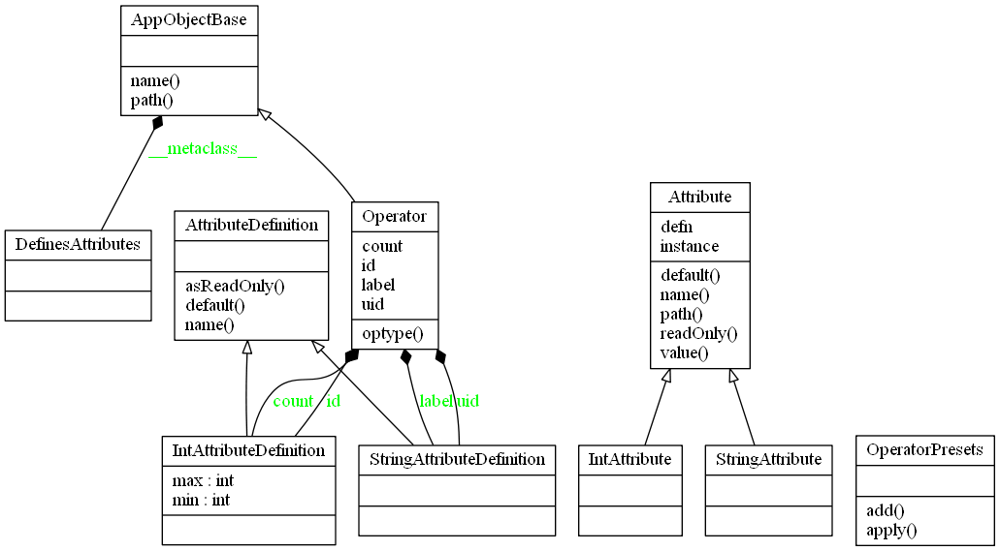

-----
About
-----

By making use of ``Python's descriptor protocol``, I have prototyped a very basic ``custom attributes system``. The attributes can also be saved and loaded back as presets. 

Attributes are defined on a class that is a subtype of ``DefinesAttributes``. At attribute definition stage, one can also mark them as read-only. When an instance of the ``DefinesAttributes`` subtype accesses the ``AttributeDefinition`` subtype, Python invokes the customized descriptor machinery and gets and sets the values.

-------------------
Classes Implemented
-------------------

  AttributeDefinition
  
  IntAttributeDefinition(AttributeDefinition)
  
  StringAttributeDefinition(AttributeDefinition)
  
  Attribute
  
  IntAttribute(Attribute)
  
  StringAttribute(Attribute)
  
  DefinesAttributes(type)
  
  AppObjectBase(__metaclass__ = DefinesAttributes )
  
  Operator(AppObjectBase)
  
  OperatorPresets

-------------
Class Diagram
-------------

__________________
Program in Action
__________________

    In [220]: oppresets = OperatorPresets()

    In [221]: (executing line 193 of "attributes.py")

    In [222]: (executing line 195 of "attributes.py")

    Operator preset 'defaults' saved for '/ops/op1'

    {'count': 0, 'id': 123, 'uid': '0x123', 'label': 'An Example Operator'}

    In [223]: (executing lines 197 to 200 of "attributes.py")

    Operator preset 'defaults' already exists

    In [224]: (executing lines 202 to 205 of "attributes.py")

    Illegal value: 0 <= 100 && 100 <= 10

    In [225]: (executing line 207 of "attributes.py")

    In [226]: (executing line 209 of "attributes.py")

    In [227]: (executing line 211 of "attributes.py")

    Operator preset 'preset1' saved for '/ops/op1'

    {'count': 9, 'id': 123, 'uid': '0x123', 'label': 'My first operator'}

    In [228]: (executing lines 213 to 216 of "attributes.py")

    Operator preset 'preset2' does not exist

    In [229]: (executing line 218 of "attributes.py")

    Operator preset 'defaults' applied to '/ops/op1'

    {'count': 0, 'id': 123, 'uid': '0x123', 'label': 'An Example Operator'}

    In [230]: (executing line 220 of "attributes.py")

    Operator preset 'preset1' applied to '/ops/op1'

    {'count': 9, 'id': 123, 'uid': '0x123', 'label': 'My first operator'}

    In [231]: (executing line 222 of "attributes.py")

    In [232]: (executing line 224 of "attributes.py")

    Operator preset 'preset1' applied to '/ops/op1'

    {'count': 9, 'id': 123, 'uid': '0x123', 'label': 'My first operator'}

_______________
References
_______________
* https://docs.python.org/2/howto/descriptor.html

* http://martyalchin.com/2007/nov/23/python-descriptors-part-1-of-2

* http://www.informit.com/articles/printerfriendly/1309289
